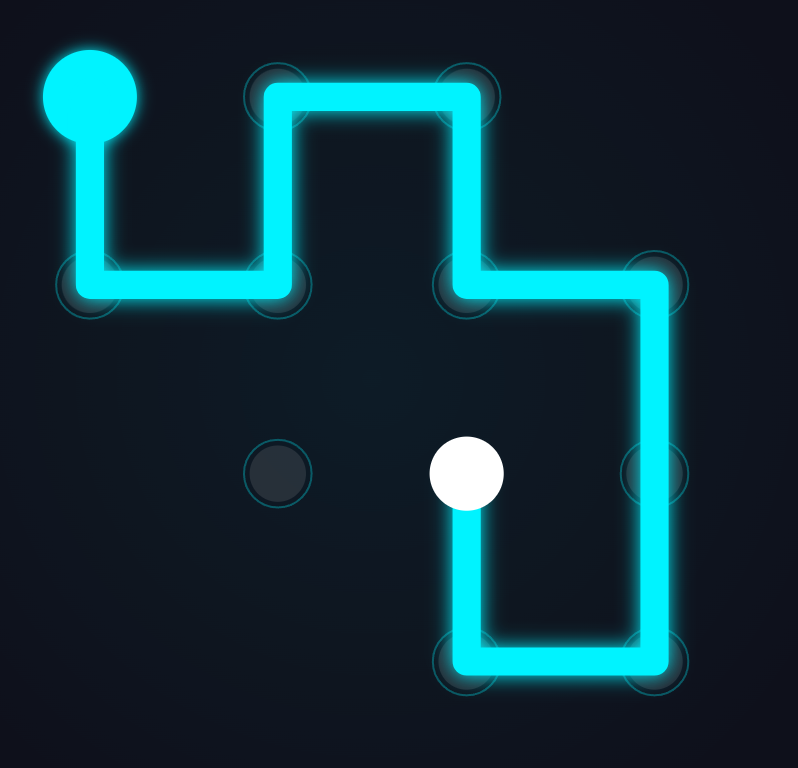
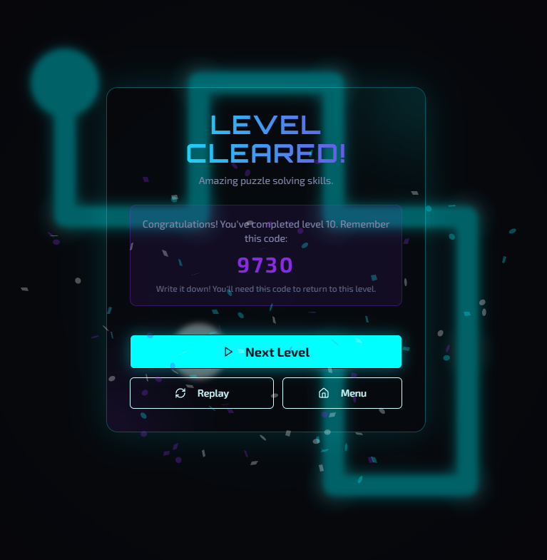
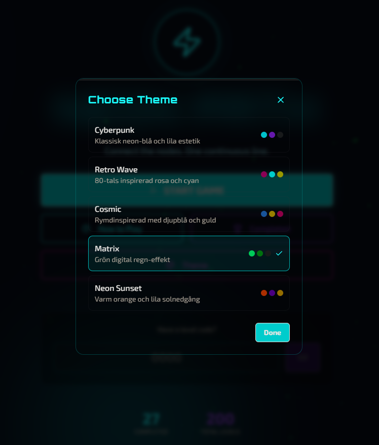

<div align="center">

# 🎮 NEON PATH PUZZLE

[](https://neon-path-puzzle.vercel.app)
[](LICENSE)
[](https://reactjs.org/)
[](https://www.typescriptlang.org/)

**A cyber-logic puzzle game where you connect all nodes with a single continuous line.**

🔥 **200 Unique Levels** | 🎨 **5 Neon Themes** | ⚡ **4 Power-ups** | 📱 **Mobile Ready**

</div>

---

## 🎮 Game Preview

<table>
  <tr>
    <td width="50%">
      <h3 align="center">🏠 Main Menu</h3>
      
    </td>
    <td width="50%">
      <h3 align="center">🎯 Gameplay</h3>
      
    </td>
  </tr>
  <tr>
    <td width="50%">
      <h3 align="center">🏆 Level Complete</h3>
      
    </td>
    <td width="50%">
      <h3 align="center">🎨 Themes</h3>
      
    </td>
  </tr>
</table>

---

## ✨ Features

- 🎯 **200 Unique Levels** - Progressive difficulty from easy to extreme
- 🎨 **5 Stunning Neon Themes** - Cyberpunk, Retro Wave, Cosmic, Matrix, Neon Sunset
- ⚡ **4 Strategic Power-ups** - Time Freeze, Path Reveal, Undo Shield, Score Boost
- 🏆 **Achievement System** - Unlock 10+ achievements as you progress
- 💾 **Level Code System** - Save your progress with unique 4-digit codes
- 📱 **Fully Responsive** - Play on desktop, tablet, or mobile

---

## 🚀 Live Demo

### **[🎮 Play Now - https://neon-path-puzzle.vercel.app](https://neon-path-puzzle.vercel.app)**

---

## 📖 How to Play

1. **🎯 Objective**: Connect all nodes with a single continuous line
2. **📍 Rules**: Visit each node exactly once, path cannot cross itself
3. **❤️ Lives**: 3 lives per level, each backtrack costs 1 life
4. **🔓 Progression**: Complete levels sequentially or use codes to jump ahead

---

## 🛠️ Tech Stack

<div align="center">

[](https://reactjs.org/)
[](https://www.typescriptlang.org/)
[](https://tailwindcss.com/)
[](https://vitejs.dev/)
[](https://www.framer.com/motion/)
[](https://nodejs.org/)

</div>

---

## 🏁 Getting Started

### Prerequisites
- Node.js 18+ 
- npm or yarn

### Installation

```bash
# Clone the repository
git clone https://github.com/RobinAyzit/Neon-Path-Puzzle.git

# Navigate to project directory
cd Neon-Path-Puzzle

# Install dependencies
npm install

# Start development server
npm run dev
```

The game will be available at `http://localhost:5000`

### Build for Production

```bash
npm run build
```

---

##  Contact & Support

<div align="center">

**Created by © nRn World**

📧 **Email**: [bynrnworld@gmail.com](mailto:bynrnworld@gmail.com)

🌐 **Website**: [https://neon-path-puzzle.vercel.app](https://neon-path-puzzle.vercel.app)

</div>

---

<div align="center">

### ⭐ Star this repository if you enjoy the game!

**[🎮 Play Now](https://neon-path-puzzle.vercel.app)** | **[📄 License](LICENSE)** | **[🐛 Report Bug](../../issues)**

</div>
